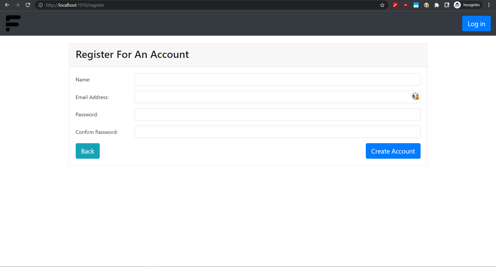
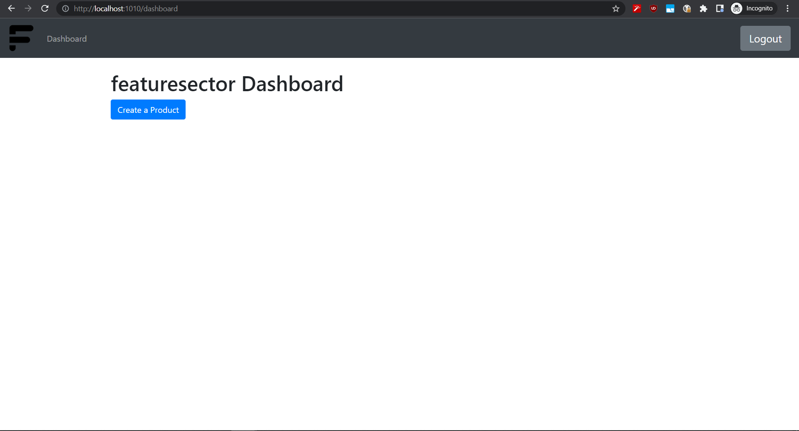
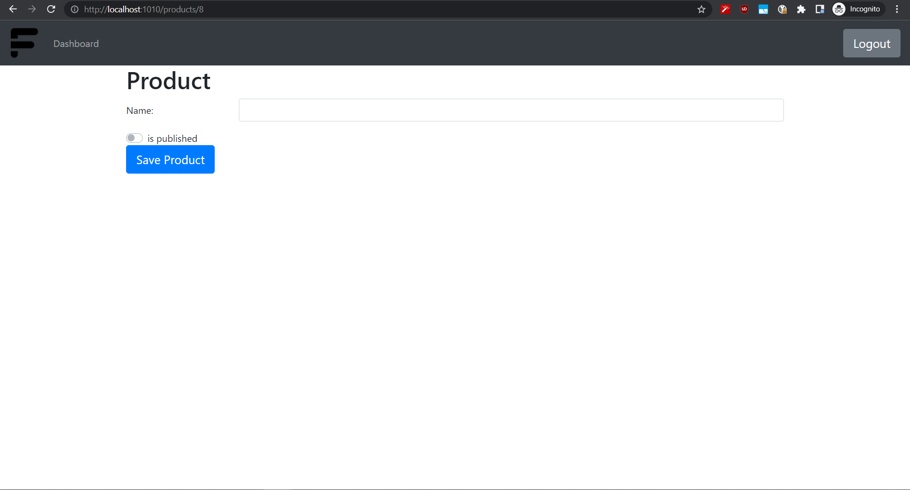

  <a href="#about" title="About">About</a> |
  <a href="#Technologies" title="Technologies">Technologies</a> |
  <a href="#Externals" title="Externals">Externals</a> |
  <a href="#Deployment" title="Deployment">Deployment</a> |
  <a href="#Database-Configuration " title="Database Configuration ">Database Configuration </a> |
  <a href="#Under-Development" title="Under Development">Under Development</a> |
  <a href="#Contributions" title="Contributing">Contributing</a>

 

# About 
- Featuresector web application allows app creators to query their users for feature suggestions.

- Users will be able to suggest new features for apps, and then other users will be able to up-vote / down-vote those feature requests.

## Technologies

* 	[Maven](https://maven.apache.org/) - Dependency Management
* 	[JDK 11](https://www.oracle.com/java/technologies/javase-jdk11-downloads.html) - Java™ Platform, Standard Edition Development Kit
* 	[Spring Boot](https://spring.io/projects/spring-boot) - Framework to ease the bootstrapping and development of new Spring Applications
* 	[Mysql](https://www.mysql.com/) - Open-Source Relational Database Management System
* 	[git](https://git-scm.com/) - Free and Open-Source distributed version control system
*   [Bootstrap](https://getbootstrap.com/) - front-end open source toolkit
*   [thymeleaf](http://thymeleaf.org/) - server-side Java template engine
*   [Spring Security](https://spring.io/projects/spring-security) -Spring Security is a powerful and highly customizable authentication and access-control framework
*   [Spring DATA JDBC](https://spring.io/projects/spring-data-jdbc)

## Externals

* [Postman](https://www.getpostman.com/) 

### sample screenshot of the completed app

  
  
  
  
