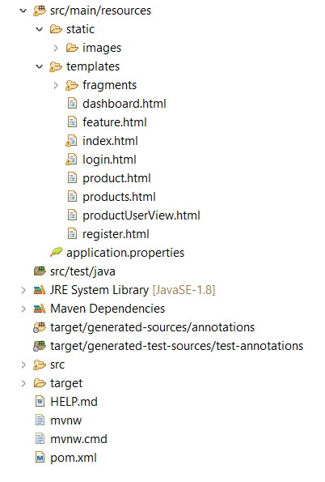
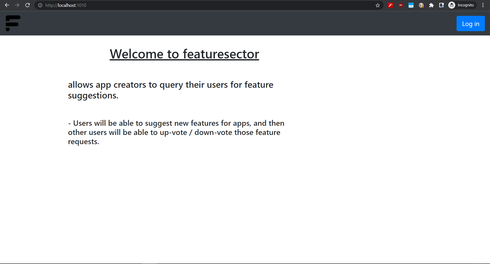

<p align="center">
  <a href="#about" title="About">About</a> |
  <a href="#Technologies" title="Technologies">Technologies</a> |
  <a href="#Prerequisites" title="Prerequisites">Prerequisites</a> |
  <a href="#Project-Structure-in-STS " title="Project Structure in STS ">Project Structure in STS </a> |
  <a href="#Local-usage" title="local-usage">Usage</a> |
  <a href="#Deployment" title="Deployment">Deployment</a> |
  <a href="#Under-Development" title="Under Development">Under Development</a> |
  <a href="#screenshot-of-the-completed-app" title="screenshots">screenshots</a> |
  <a href="#Contributions" title="Contributions">Contributions</a> 
</p>

<br>

# About 
- Featuresector web application allows app creators to query their users for feature suggestions.

- Users will be able to suggest new features for apps, and then other users will be able to up-vote / down-vote those feature requests.

## Technologies

* 	[Maven](https://maven.apache.org/) 
* 	[JDK 11](https://www.oracle.com/java/technologies/javase-jdk11-downloads.html)
* 	[Spring Boot](https://spring.io/projects/spring-boot) 
* 	[Mysql](https://www.mysql.com/) 
* 	[git](https://git-scm.com/) 
*   [Bootstrap](https://getbootstrap.com/) 
*   [javascript](https://developer.mozilla.org/en-US/docs/Web/JavaScript) 
*   [thymeleaf](http://thymeleaf.org/) 
*   [Spring Security](https://spring.io/projects/spring-security) 
*   [Spring DATA JPA](https://spring.io/projects/spring-data-jpa)

## Prerequisites

* 	[Maven](https://maven.apache.org/) 
* 	[JDK 11 or above](https://www.oracle.com/java/technologies/javase-jdk11-downloads.html)
* 	[Mysql](https://www.mysql.com/) 
* 	[Eclipse](https://www.eclipse.org/ide/) or [STS](https://spring.io/tools) 
*   [Postman](https://www.getpostman.com/) 

## Project-Structure-in-STS



## local-usage 
-  clone the repo
```bash 
 > $ git clone git@github.com:spiderocta/featuresector.git
```

- Open the project using Eclipse or Spring tool Suit 
> This is gonna be building the maven dependencies too

-  create a database called `featuresector` in MySQL
> or create it with another name. However, you must rename it in
``` bash 
> src/main/resources/application.properties
```

- to change the port in the `src/main/resources/application.properties` set the port number using 
```bash 
#for specific port number
> server.port = {port number}

#for random port number 
> server.port = 0
``` 


## Deployment
-  [Deploying To Heroku using Maven Plugin](https://devcenter.heroku.com/articles/deploying-java-applications-with-the-heroku-maven-plugin) 
-  [Deploying To Heroku using git Repo](https://devcenter.heroku.com/articles/deploying-spring-boot-apps-to-heroku#preparing-a-spring-boot-app-for-heroku)


## Under-Development

- [ ] Fixing comment section and votes
- [ ] user profile
- [ ] profile link inside dashboard
- [ ] restful Web Service
- [ ] automatic auditing
- [ ] logging and actuator


### screenshot-of-the-completed-app

  
  
  
  

# Contributions

#### In case you find a bug or have a suggested improvement
The [issue tracker](https://github.com/spiderocta/featuresector/issues) is the preferred channel for bug reports, features requests and submitting pull requests.
